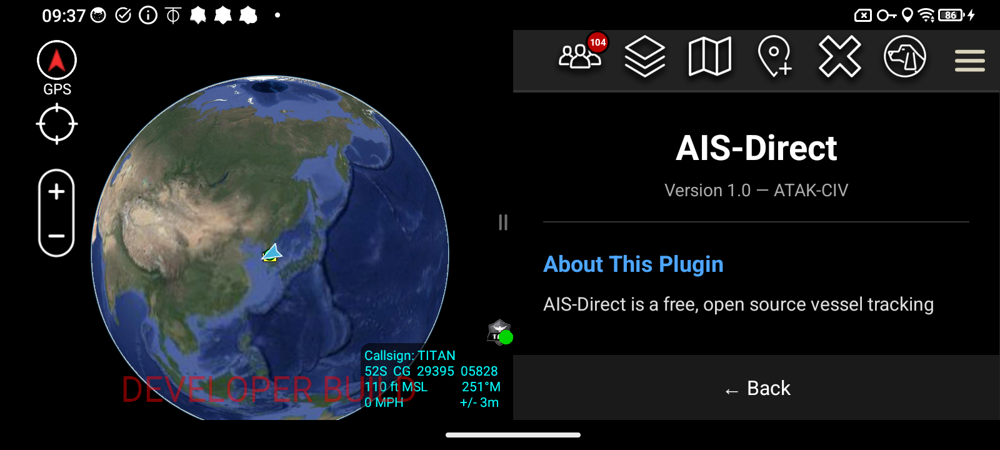
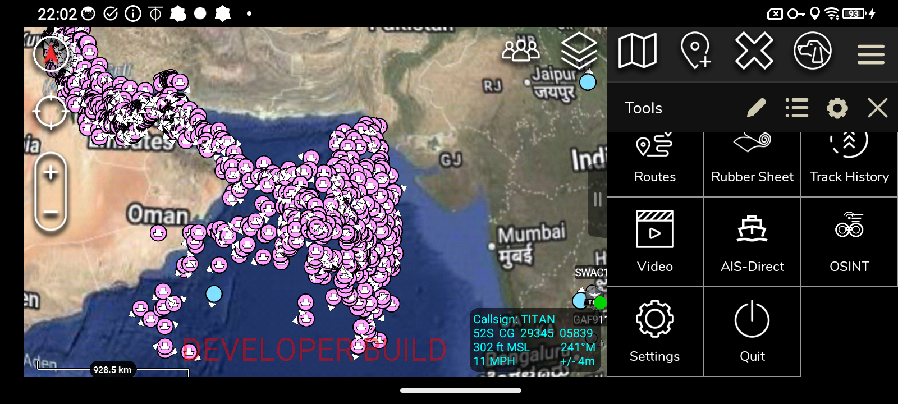
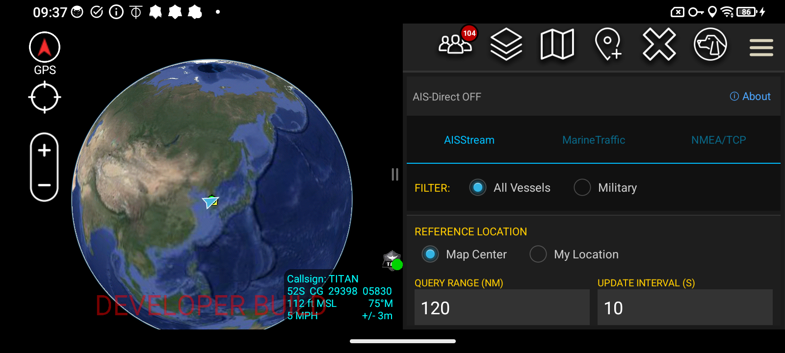
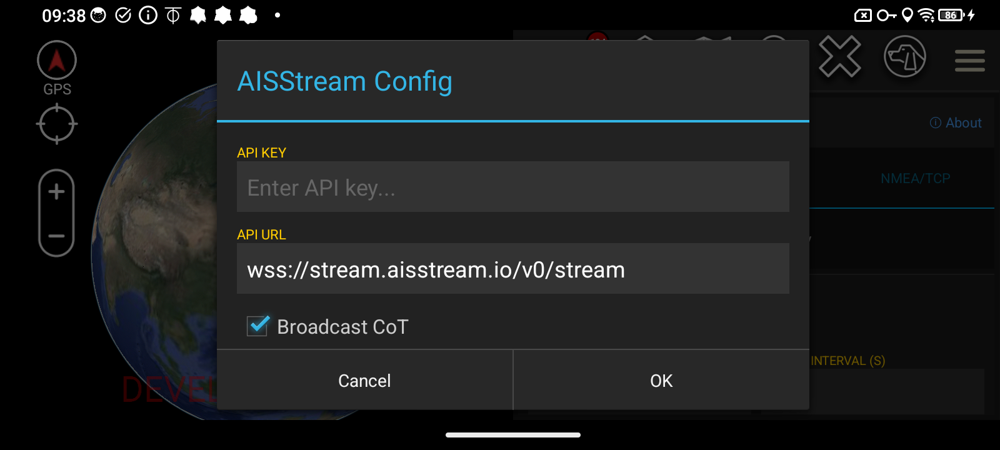
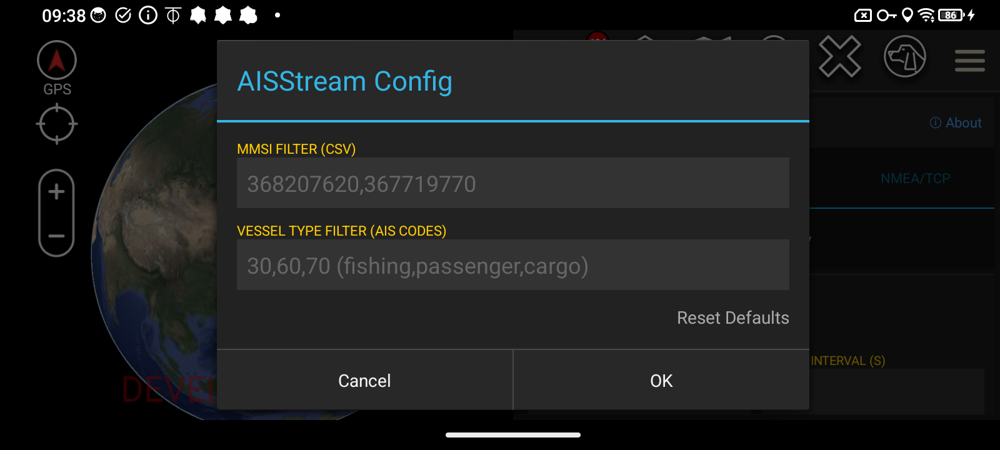

# AIS-Direct Plugin for ATAK

**Version:** 3.0 — ATAK-CIV | Free & Open Source

---

---

## Download

| Version | Type | Status |
|---------|------|--------|
| v3.0 | Blue Shield (TAK.GOV Approved) | Available on GitHub |

Download the APK from the **[Releases](https://github.com/saltyoperatorarizona/SaltyOperator-ATAK/releases)** page of this repository.

Blue Shield certificate — TAK.GOV approved, same trust level as the official Meshtastic ATAK plugin. Compatible with Play Store ATAK (ATAK-CIV). Sideload ready.

---

## About This Plugin

AIS-Direct is a free, open source vessel tracking plugin for ATAK. Designed to function like ADSB-Direct (the popular aircraft tracking plugin), AIS-Direct brings real-time Automatic Identification System (AIS) data directly into the ATAK interface — allowing operators to monitor maritime vessel traffic worldwide without ever leaving the app.

Users can connect to live AIS data streams and display vessel positions, headings, speeds, and call signs directly on the ATAK map. Stream data can be filtered by geographic range or reference location, giving operators the ability to focus on vessels within a defined operational area. A dedicated Military quick filter allows users to instantly isolate military vessels from the broader traffic picture.

AIS-Direct supports multiple data source backends including AISStream (WebSocket), MarineTraffic, and direct NMEA/TCP connections, making it compatible with a wide range of AIS receivers and online services.

## How to Access

Once installed, open the ATAK Tools menu and tap **AIS-Direct** to launch the plugin. It sits alongside your other ATAK tools — including OSINT — for quick access during maritime operations.

## AIS-Direct Main Panel

The main panel displays the current connection status and stream configuration. Toggle AIS-Direct ON or OFF directly from the panel header.

Three data source tabs are available at the top:
- **AISStream** — WebSocket-based live global AIS feed (`wss://stream.aisstream.io/v0/stream`)
- **MarineTraffic** — Integration with MarineTraffic API
- **NMEA/TCP** — Direct connection to a local AIS receiver or NMEA TCP feed

## Vessel Filters

The FILTER section provides two options:
- **All Vessels** — Displays every AIS-broadcasting vessel within your configured range and location
- **Military** — Instantly filters the map to show only military vessels, enabling rapid maritime domain awareness in operational environments

