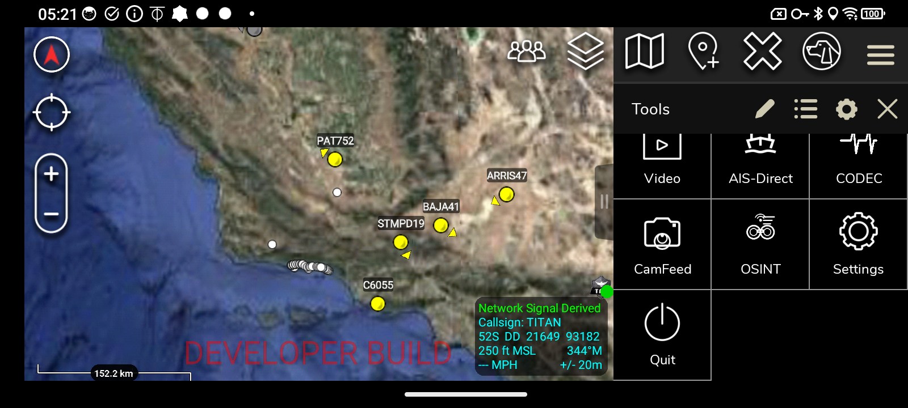
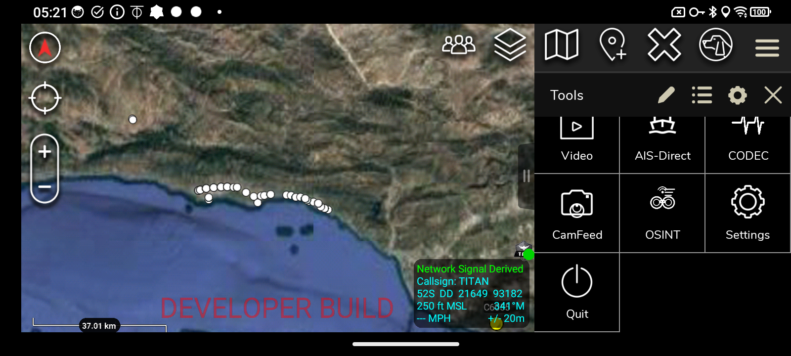
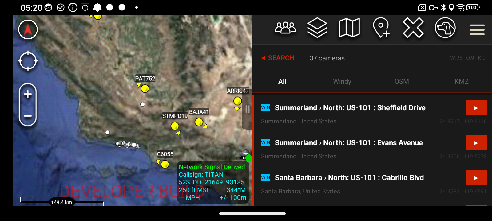
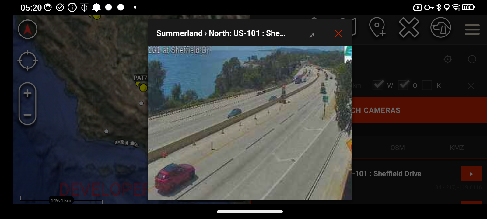
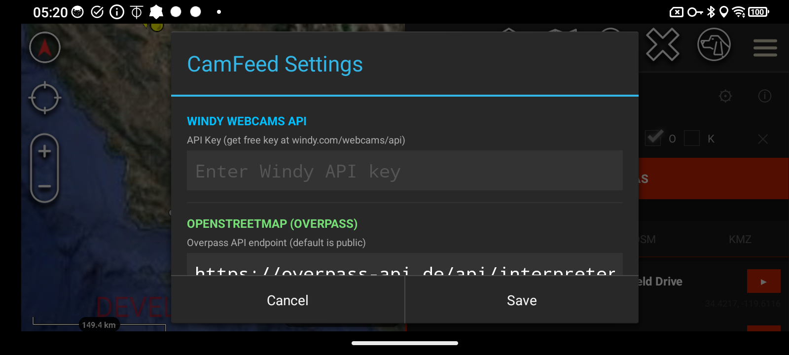
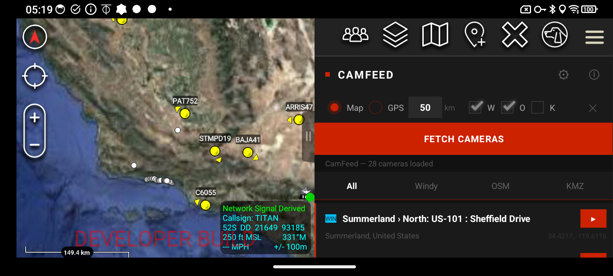

# CamFeed — Bulk Public Camera Feed Aggregator for ATAK

**Version:** 1.0 — ATAK-CIV | **Free & Open Source**

---

---

## Download

| Version | Type | Status |
|---------|------|--------|
| v1.0 | Debug Signed | Available on GitHub |

Download the APK from the **[Releases](https://github.com/saltyoperatorarizona/SaltyOperator-ATAK/releases)** page of this repository.

---

## About This Plugin

CamFeed is a free, open source ATAK-CIV plugin that queries multiple public data sources to discover webcams and surveillance cameras near any map location. Results are displayed as CoT markers on the ATAK map and listed in a scrollable panel with direct stream access — no external browser required.

Built for ATAK 5.6, targeting operators who need rapid environmental awareness through publicly available camera infrastructure.

---

## How to Access

Tap the **CamFeed** icon in the ATAK Tools menu to launch the plugin. It sits alongside your other ATAK tools for quick access during operations.

---

## Features

- **Three data sources in one plugin:**
  - **Windy Webcams API** — 50,000+ public webcams worldwide (free API key required at [windy.com/webcams/api](https://windy.com/webcams/api))
  - **OpenStreetMap Overpass** — surveillance camera nodes tagged as publicly accessible
  - **KMZ/KML file import** — load local camera lists (e.g. AZ511 traffic feeds, municipal CCTV exports)
- **Map-integrated markers** — cameras post as CoT markers on the ATAK map, color-coded by source (blue = Windy, green = OSM, orange = KMZ)
- **Tap-to-view from map** — tap any camera marker on the map to open its stream directly
- **Built-in stream viewer** — JPEG snapshot viewer with auto-refresh every 30 seconds; WebView for embed/web streams; ATAK native video tool for RTSP/MJPEG
- **Expand to fullscreen** — stream viewer includes a fullscreen toggle (⤢) and close button (✕)
- **Filter by source** — tabs to view All, Windy, OSM, or KMZ cameras independently
- **Collapsible search panel** — after fetching, search controls collapse so the full camera list is visible; tap ◀ SEARCH to return
- **Search by radius** — set any radius in km, referenced to map center or GPS location
- **Live camera count** — header shows W / O / K counts and total
- **Deduplication** — cameras that appear in multiple sources are merged automatically

---

## Camera List & Source Tabs

After fetching, the results panel shows all cameras with source badges, names, coordinates, and a ▶ play button for instant stream access. Use the **All / Windy / OSM / KMZ** tabs to filter by source.

---

## Live Stream Viewer

Tap ▶ on any camera row to open the built-in stream viewer. JPEG snapshots auto-refresh every 30 seconds. Tap ⤢ to expand to fullscreen, ✕ to close and return to the list.

---

## Settings

Tap ⚙ in the panel header to configure CamFeed.

| Setting | Description |
|---------|-------------|
| Windy API Key | Free key from [windy.com/webcams/api](https://windy.com/webcams/api) |
| Overpass URL | Custom Overpass endpoint (default: overpass-api.de) |
| KMZ File Path | Full path to a local .kmz or .kml file |
| Post CoT Markers | Toggle camera markers on the ATAK map |
| OSM: Skip cameras without stream URL | Filter OSM nodes that have no stream data |

---

## Data Sources

| Source | Data | Limit | Key Required |
|--------|------|-------|-------------|
| Windy Webcams API v3 | Public webcams worldwide | 500 per fetch | Yes (free) |
| OpenStreetMap Overpass | man_made=surveillance nodes | 200 per fetch | No |
| KMZ/KML | Local file | Unlimited | No |

---

## Requirements

- ATAK-CIV 5.6+
- Android 8.0+
- Windy API key (free registration) for Windy source
- Internet connection for Windy and OSM sources
- KMZ/KML file on device storage for local import

---

## Installation

1. Download the `.apk` from the [Releases](https://github.com/saltyoperatorarizona/SaltyOperator-ATAK/releases) page
2. On your ATAK device, go to **Settings → Manage Plugins → Install Plugin**
3. Select the downloaded APK
4. Grant storage permission if prompted
5. Plugin icon appears in the ATAK toolbar

---

## How to Use

1. Tap the camera icon in the ATAK toolbar to open CamFeed
2. Tap ⚙ **Settings** and enter your Windy API key
3. Optionally set a KMZ file path for local camera import
4. Select **Map** (use current map center) or **GPS** (use your device location) as the reference point
5. Enter a search radius in kilometers (default 50 km)
6. Enable/disable sources using the **W** (Windy), **O** (OSM), **K** (KMZ) checkboxes
7. Tap **FETCH CAMERAS** — the search panel collapses and results populate the list
8. Cameras also appear as colored markers on the ATAK map
9. Tap ▶ on any row to open the live stream viewer
10. In the viewer, tap ⤢ to expand to fullscreen, ✕ to close
11. Tap ◀ SEARCH at the top to return to the search panel and run a new search
12. Tap ✕ in the search bar to clear all cameras and markers

---

## Map Markers

Camera CoT markers are color-coded by source and appear directly on the ATAK map. Tap any marker to open its stream without leaving the map view.

---

## Notes

- All data is publicly accessible — no private or restricted feeds are accessed
- Windy cameras display as JPEG snapshots (auto-refreshed every 30s), not live video
- OSM nodes are community-tagged and quality varies by region
- RTSP/MJPEG streams from KMZ files open in ATAK's built-in video tool
- Not affiliated with or endorsed by the TAK Product Center

---

## About the Developer

Stephan Pellegrini is a military defense professional with extensive experience in ISR systems, situational awareness platforms, and tactical operations. Passionate about ATAK and the broader TAK ecosystem, he develops free plugins for the operator community.

## Contact & License

Contact: saltyoperatorarizona@gmail.com

This plugin is provided free of charge with no warranty. Use at your own discretion. Not affiliated with or endorsed by the TAK Product Center.
