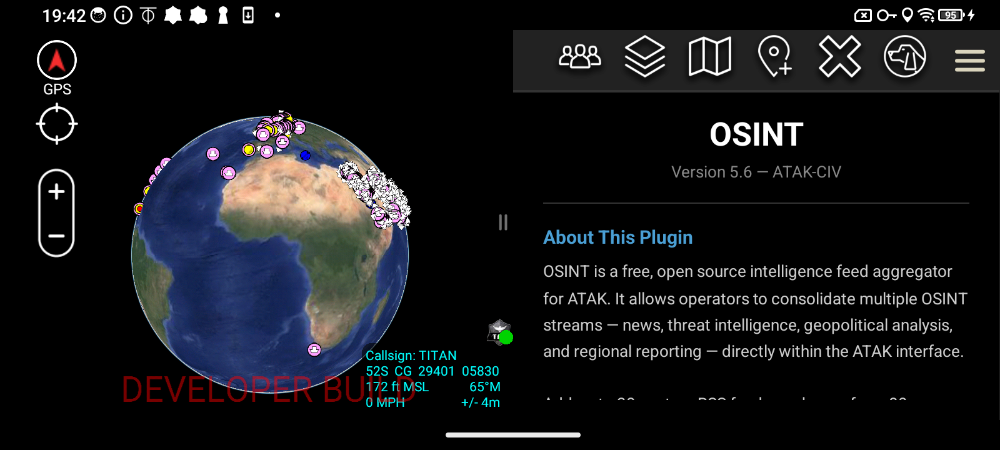

# OSINT Plugin for ATAK

**Version:** 5.6 — ATAK-CIV | **Free & Open Source**

---

---

## Download

| Version | Type | Status |
|---------|------|--------|
| v5.6.3 | Blue Shield (TAK.GOV Approved) | Available on GitHub |

Download the APK from the [Releases](../../releases) page of this repository. Blue Shield certificate — TAK.GOV approved, same trust level as the official Meshtastic ATAK plugin. Compatible with Play Store ATAK (ATAK-CIV). Sideload ready.

---

## About This Plugin

OSINT is a free, open source intelligence feed aggregator for ATAK. It allows operators to consolidate multiple OSINT streams directly within the ATAK interface — news, threat intelligence, geopolitical analysis, and regional reporting — without ever leaving the app.

Add up to 30 custom RSS feeds or choose from 80 curated presets across four categories: Defense & Military, Intelligence & OSINT, Geopolitics, and Regional.

## How to Access

Once installed, open the ATAK Tools menu and tap OSINT to launch the plugin. It sits alongside your other ATAK tools for quick access during operations.

## OSINT Feeds Panel

The main panel shows all active feeds and their latest articles in real time. Filter by category tab at the top, and see the total article and feed count at a glance. Tap READ on any article to open the full in-app summary.

## Reading Articles

Tapping READ opens the article summary view directly inside ATAK. The source name, headline, timestamp, and full article summary are displayed in a clean monospace terminal-style interface. Scroll down within the article view to read the full article body, complete with hashtags for quick topic identification. Tap OPEN ORIGINAL ARTICLE to launch the full source in ATAK's built-in browser — keeping you fully in your operational environment.

## Adding & Managing Feeds

Tap + ADD FEEDS from the main panel to manage your sources. Choose from 80 curated presets organized by category, or enter any custom RSS feed URL from anywhere in the world.

### Curated Preset Feeds

80 hand-picked sources across four categories. Defense & Military includes feeds like DoD News, Military Times, Breaking Defense, and Stars & Stripes. Tap + to add any source instantly.

### Custom RSS Feed

Add any RSS feed from anywhere in the world. Enter a name and paste the URL, then tap + ADD CUSTOM FEED. Supports up to 30 total active feeds.

### Refresh Rate

Control how frequently your feeds update. Options range from Auto (1 min) for live operational awareness to 24 hours for low-bandwidth environments.

---

## About the Developer

Stephan Pellegrini is a military defense professional with extensive experience in ISR systems, situational awareness platforms, and tactical operations. Passionate about ATAK and the broader TAK ecosystem, he developed this plugin as a free resource for the operator community. Additional plugins are currently in development, including AIS vessel tracking and team health monitoring integrations.

## Contact & License

Contact: saltyoperatorarizona@gmail.com

This plugin is provided free of charge with no warranty. Use at your own discretion. Not affiliated with or endorsed by the TAK Product Center.
