# OSINT Plugin for ATAK

**Version:** 5.6 — ATAK-CIV

---

## About This Plugin

OSINT is a free, open source intelligence feed aggregator for ATAK. It allows operators to consolidate multiple OSINT streams — news, threat intelligence, geopolitical analysis, and regional reporting — directly within the ATAK interface.

Add up to 30 custom RSS feeds or choose from 80 curated presets across four categories:

- Defense & Military
- Intelligence & OSINT
- Geopolitics
- Regional

---

## How to Access

The OSINT plugin is accessible directly from the ATAK **Tools** menu. Open the Tools panel and tap **OSINT** to launch the plugin.

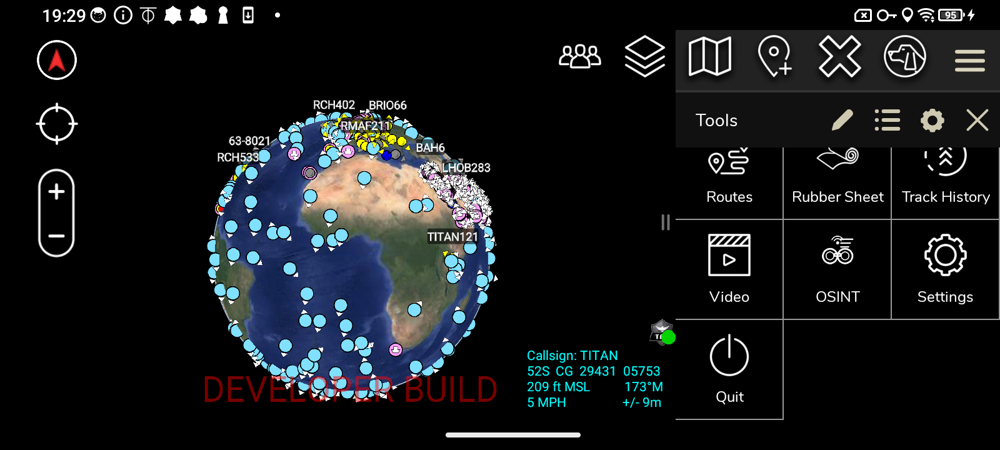

---

## OSINT Feeds Panel

The main **OSINT Feeds** panel displays all active feeds and their latest articles. Filter by category and see the total article and feed count at a glance. Tap **READ** on any article to open the full summary view.

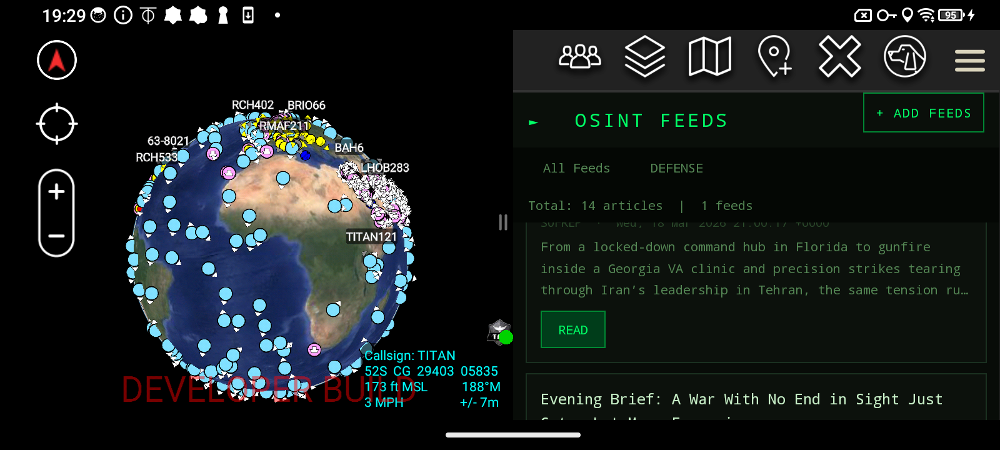

---

## Reading Articles

Tapping **READ** opens a full article summary view within ATAK. The source, title, timestamp, and a detailed summary are displayed in a clean terminal-style interface.

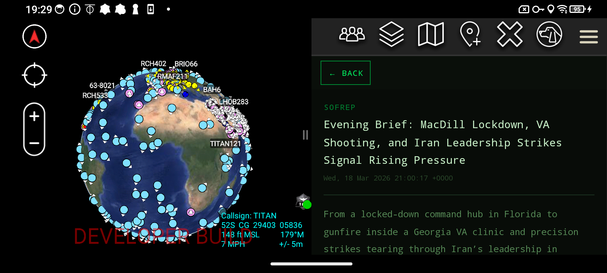

### Full Article Text

Scroll down within the article view to see the complete article body along with hashtags for quick topic identification.

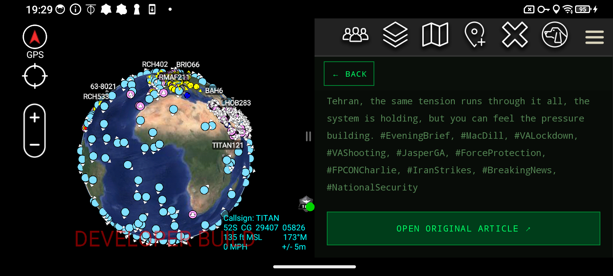

### Open Original Article

Tap **OPEN ORIGINAL ARTICLE** to launch the source website within ATAK built-in browser.

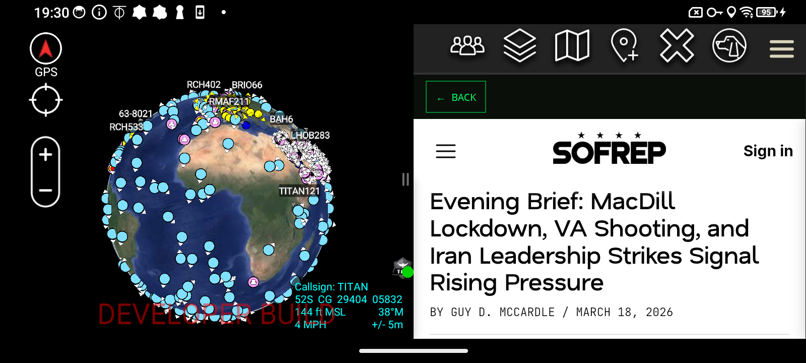

---

## Adding Feeds

Tap **+ ADD FEEDS** from the main panel to manage your feed sources.

### Curated Preset Feeds

Browse and add presets with a single tap. The Defense and Military category includes sources such as DoD News, Military Times, Breaking Defense, and Stars and Stripes.

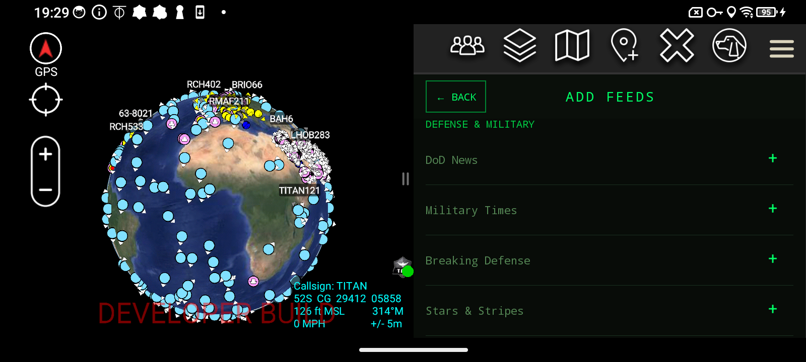

### Custom RSS Feed

Enter any RSS feed URL manually. Give it a name, paste the feed URL, and tap **+ ADD CUSTOM FEED**.

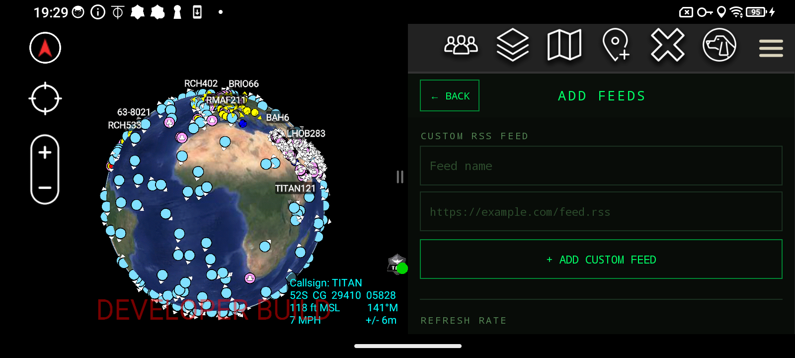

### Refresh Rate

Set how often your feeds automatically update. Options range from Auto 1 min to 24 hours.

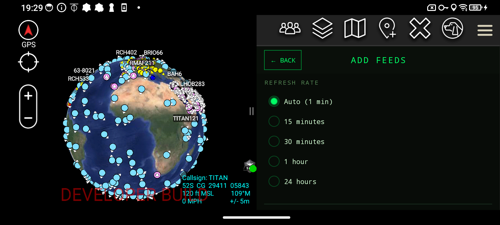

---

## In-App About Screen

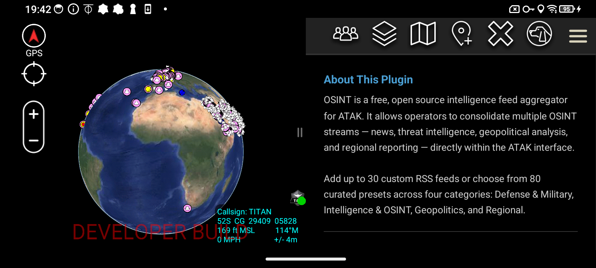

---

## About the Developer

Stephan Pellegrini is a military defense professional with extensive experience in ISR systems, situational awareness platforms, and tactical operations. Passionate about ATAK and the broader TAK ecosystem, he developed this plugin as a free resource for the operator community.

Additional plugins are currently in development, including AIS vessel tracking and team health monitoring integrations.

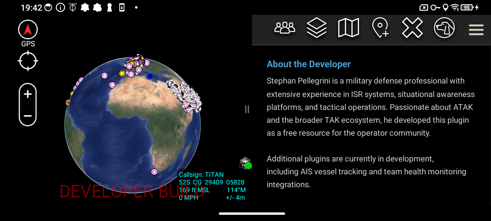

---

## Contact and License

**Contact:** saltyoperatorarizona@gmail.com

This plugin is provided free of charge with no warranty. Use at your own discretion. Not affiliated with or endorsed by the TAK Product Center.

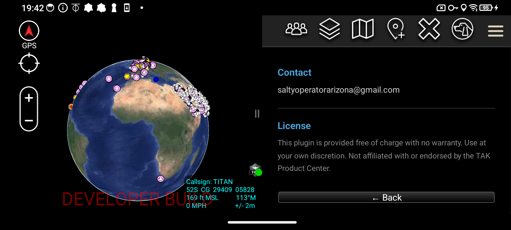
