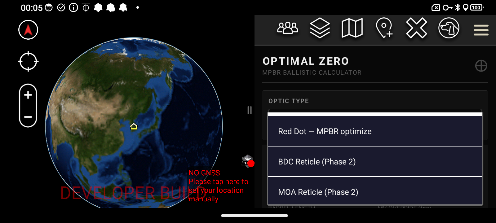
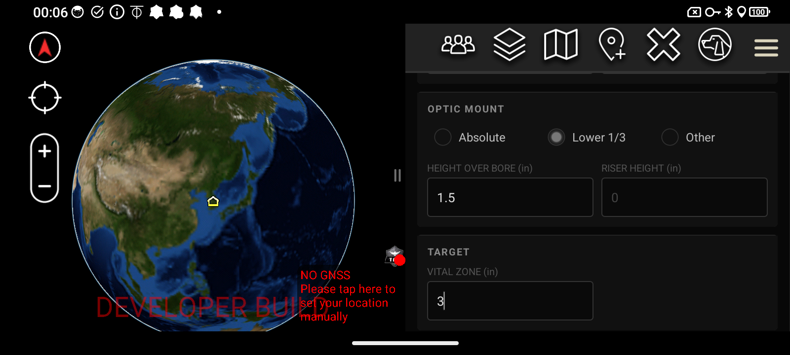
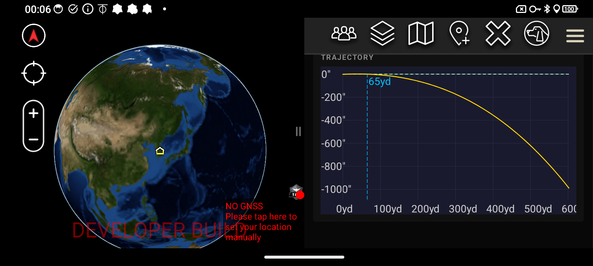

# Optimal Zero MPBR Ballistic Calculator for ATAK

**Version:** 1.0 — ATAK-CIV 5.6.0 | **Package:** com.optimalzero.plugin

> ✅ **APPROVED BY TAK.GOV — NOW AVAILABLE FOR DOWNLOAD.** This plugin has been approved by the TAK Product Center and is available for installation via TAK.Gov.

---

---

## About This Plugin

Optimal Zero is a free ATAK-CIV plugin that implements a G1 ballistics engine to calculate the optimal zero distance for Maximum Point Blank Range (MPBR). Enter your optic type, caliber, load, barrel length, optic mount, and vital zone — the plugin returns your optimal zero distance, MPBR distance, a drop table at standard intervals, and a full rendered trajectory chart.

Built for ATAK 5.6, targeting operators who need fast, accurate ballistic solutions directly in their tactical interface without leaving the map environment.

---

## How to Access

Tap the **Optimal Zero** icon in the ATAK Tools menu to open the plugin side panel. The OPTIMAL ZERO header and MPBR BALLISTIC CALCULATOR subtitle appear at the top of the panel.

---

## Features

- **Optic type selection** — Red Dot MPBR fully implemented; BDC Reticle, MOA Reticle, and Mil Reticle modes are Phase 2
- **Full ammo database** — caliber-specific G1 BC and per-load MV curves by barrel length
- **Barrel length 4"–24"** — covers PDW, pistol, PCC, carbine, and precision rifle with automatic MV calculation per caliber and load
- **MV override field** — enter chronograph-verified velocity to bypass the auto-calculated MV
- **Optic mount cowitness** — Absolute / Lower 1/3 / Other with Height Over Bore and Riser Height inputs
- **Vital zone input** — define the MPBR hit envelope in inches
- **CALCULATE MPBR button** — gold, the only color in an otherwise black/gray tactical UI
- **Solution output** — optimal zero (yd and m), MPBR distance (yd and m), near zero distance
- **Drop table** — in-zone indicators (✓/✗) at standard distances from 25 to 500yd
- **Trajectory chart** — full rendered arc showing bullet path with zero distance marked

---

## Screenshot Walkthrough

### Plugin Open — Side Panel

The plugin opens in the ATAK side panel showing the OPTIMAL ZERO header, MPBR BALLISTIC CALCULATOR subtitle, OPTIC TYPE showing "Red Dot — MPBR optimize", and WEAPON/AMMUNITION showing "9mm / 147gr FMJ (Subsonic)".

---

### Optic Type Dropdown

Tap the OPTIC TYPE field to open the dropdown. Available selections:

- Red Dot — MPBR optimize *(fully implemented)*
- BDC Reticle *(Phase 2)*
- MOA Reticle *(Phase 2)*
- Mil Reticle *(Phase 2)*

---

### Weapon / Ammunition Section

The WEAPON/AMMUNITION section shows the selected ammo, BARREL LENGTH set to 5", and MV OVERRIDE displaying "Auto: 1200 fps". OPTIC MOUNT radio buttons allow selection of Absolute / Lower 1/3 / Other.

---

### Ammunition Dropdown

The full ammunition list spans multiple calibers and loads. Tap the ammo field to open the dropdown.

---

### Optic Mount Section

OPTIC MOUNT set to Lower 1/3, with HEIGHT OVER BORE at 1.5", RISER HEIGHT at 0, and TARGET VITAL ZONE at 3".

---

### Calculate MPBR — Solution Output

Tap the gold **CALCULATE MPBR** button to generate the ballistic solution. Example output for 9mm/147gr Subsonic, 5" barrel, 980fps, HOB 1.50", VZ 3":

- **Zero:** 65yd (59m)
- **MPBR:** 75yd (69m)
- **Near zero:** ~0yd

---

### Drop Table

The SOLUTION includes a full DROP TABLE at 25yd–75yd increments showing bullet drop in inches and in-zone checkmarks (✓) at each distance.

---

### Trajectory Chart

The TRAJECTORY chart renders a full bullet arc from 0 to 600+ yards with the 65yd optimal zero marked. The Y-axis shows drop in inches.

---

## Ammunition Database

| Caliber | Loads |
|---------|-------|
| 5.56x45 NATO | 55gr FMJ (M193), 62gr FMJ (M855), 77gr OTM (Mk262) |
| 7.62x51 NATO | 147gr FMJ (M80), 168gr HPBT (M118LR), .308 Win 175gr HPBT |
| 7.62x39 | 123gr FMJ, 123gr HP, 154gr SP |
| 300 BLK Supersonic | 110gr V-MAX, 125gr, 150gr FMJBT |
| 300 BLK Subsonic | 190gr, 208gr, 220gr — dedicated subsonic MV curve |
| .277 Fury / 6.8x51 | 135gr OTM (SIG NGSW standard), 140gr OTM (match) — SIG SPEAR data, 13"–24" barrel, ~2830–3150fps |
| 6.5 Creedmoor | 140gr ELD-M |
| 5.7x28 | 27gr SS190 (P90 / Five-seveN), 40gr V-MAX (civilian) |
| 9mm | 115gr FMJ, 124gr FMJ, 147gr FMJ Subsonic |
| 45 ACP | 185gr JHP, 230gr FMJ |

Barrel lengths: **4"–24"** covering PDW, pistol, PCC, carbine, and precision rifle.

---

## Requirements

- ATAK-CIV 5.6+
- Android 8.0+

---

## Availability

This plugin has been **approved by TAK.Gov** (TAK Product Center) and is available for download.

**To install:** Search for "OptimalZero" in the TAK.Gov plugin marketplace, or download the `.apk` directly from the [Releases](https://github.com/saltyoperatorarizona/SaltyOperator-ATAK/releases) page and sideload onto your ATAK-CIV device.

---

## Notes

- Red Dot MPBR mode is the only fully implemented optic type in v1.0; BDC, MOA, and Mil reticle modes are planned for Phase 2
- All G1 ballistic coefficients and MV curves are sourced from manufacturer data and validated against published ballistic tables
- The CALCULATE MPBR button is intentionally gold — the only color element in an otherwise black/gray tactical UI
- Not affiliated with or endorsed by the TAK Product Center

---

## About the Developer

Stephan Pellegrini is a military defense professional with extensive experience in ISR systems, situational awareness platforms, and tactical operations. Passionate about ATAK and the broader TAK ecosystem, he develops free plugins for the operator community.

## Contact & License

Contact: saltyoperatorarizona@gmail.com

This plugin is provided free of charge with no warranty. Use at your own discretion. Not affiliated with or endorsed by the TAK Product Center.
